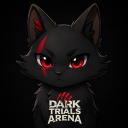
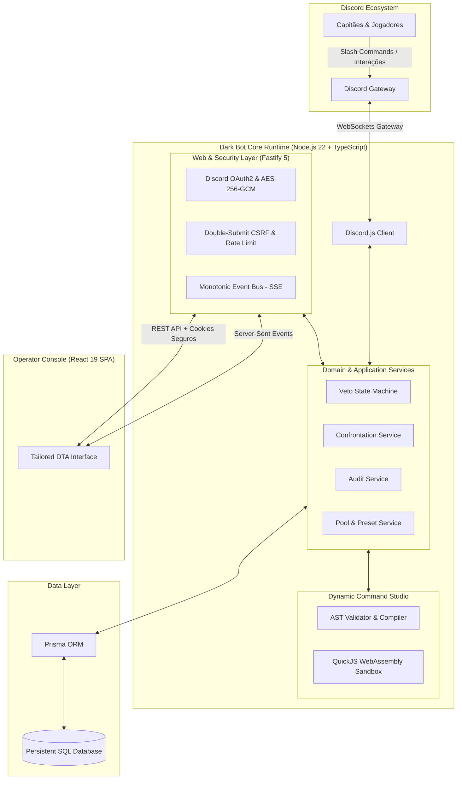

<p align="center">
  
</p>

<h1 align="center">Dark Bot — Competitive Esports Platform</h1>

<p align="center">
  Plataforma unificada para orquestração de torneios competitivos 5v5 de <b>Dead by Daylight</b>.<br/>
  Integração em tempo real entre Discord Gateway, motor de veto determinístico, sandbox de execução segura e dashboard administrativo reativo.
</p>

<p align="center">
  
  
  
  
  
  
  
  
</p>

---

## Visão Geral do Projeto

O **Dark Bot** foi desenvolvido para resolver os gargalos de governança e sincronização em torneios de esportes eletrônicos de grande escala da **Dark Trials Arena (DTA)**. O sistema substitui processos manuais de organização por uma arquitetura híbrida de alta disponibilidade:

- **Automação de Torneios no Discord**: Gestão do ciclo de vida completo de confrontos competitivos, incluindo alocação de times, sorteio de iniciativa e execução de picks/bans.
- **Painel Administrativo em Tempo Real**: SPA moderna para operadores e juízes monitorarem confrontos, auditarem eventos ao vivo e editarem regras sem necessidade de comandos no chat.
- **Estúdio de Comandos Dinâmicos (Low-Code Sandbox)**: Capacidade de criar, simular e publicar comandos customizados por servidor em tempo de execução sem reiniciar a aplicação ou tocar na base de código.

---

## Arquitetura do Sistema

A aplicação roda em um único processo coeso e concorrente, compartilhando contratos de domínio estritos entre o bot do Discord e a API do painel web.



---

## Destaques de Engenharia

### 1. Máquina de Estados Determinística para Vetos
O fluxo competitivo de seleção e banimento de killers e mapas nos formatos **Melhor de 3 (MD3)** e **Melhor de 5 (MD5)** é modelado através de uma máquina de estados finita:
- **Resolução de Concorrência**: Impede que interações simultâneas de capitães gerem estados inválidos ou quebras de turno.
- **Sorteio e Alternância de Iniciativa**: Algoritmo que balanceia a vantagem competitiva de pick/ban entre os sets com registro de desempate auditável.
- **Isolamento de Tenant**: Confrontos e pools são estritamente isolados por `guildId`, garantindo segurança multisservidor.

### 2. Sandbox de Execução Isolada (QuickJS WebAssembly)
Para permitir que organizadores customizem fluxos e scripts sem comprometer a segurança da infraestrutura:
- Os scripts são executados em um runtime **QuickJS isolado compilado para WebAssembly**.
- **Limites Rígidos de Recursos**: Cada script possui teto de 8 MB de memória RAM alocada e 200 ms de tempo de CPU.
- **Zero Acesso ao Sistema**: Nenhuma permissão de rede, acesso a arquivos, variáveis de ambiente ou APIs do Node.js (`eval`, `Function`, `fs` desabilitados).
- **SDK Restrita**: Apenas métodos autorizados e auditados de interação com Discord e variáveis validadas via Zod são expostos.

### 3. Segurança Defensiva e Criptografia
- **Proteção Criptográfica em Repouso**: Tokens de acesso e segredos OAuth2 são armazenados criptografados com **AES-256-GCM** autenticado com vetor de inicialização único.
- **Sessões e Identidade**: Tokens de sessão opacos com representação em banco protegida por hash **SHA-256** e cookies `HttpOnly`, `SameSite=Lax` e `Secure`.
- **Proteção CSRF e Anti-Abuso**: Validação rigorosa com estratégia double-submit cookie em mutações administrativas e rate limiting adaptativo no Fastify.
- **Sanitização de Erros**: Tratamento global de exceções que oculta detalhes de banco de dados e stacktraces de respostas externas, prevenindo vazamento de informações.

### 4. Console Operacional Reativo (React 19 + Fastify SSE)
- **Sincronização em Baixa Latência**: Mudanças de estado ocorridas via Discord ou painel são propagadas instantaneamente via **Server-Sent Events (SSE)** com barramento de sequência monotônica.
- **Design System Customizado**: Interface escura operacional alinhada à identidade visual da Dark Trials Arena, construída com tokens CSS nativos, tipografia tabular monospaçada (`JetBrains Mono Variable`) e suporte a acessibilidade **WCAG 2.2 AA**.
- **Internacionalização (i18n)**: Suporte completo em tempo real para múltiplos idiomas (`pt-BR`, `en-US`, `es-ES`).

### 5. Confiabilidade e Cobertura de Testes
O projeto conta com **164 testes automatizados** cobrindo todas as camadas críticas:
- **Testes de Contrato de Comandos**: Garantia de que a especificação pública dos 11 comandos nativos nunca sofra regressões acidentais.
- **Testes de Criptografia & Auth**: Validação matemática de encriptação, decriptação, rotação e expiração de sessões.
- **Testes de Migração de Banco**: Testes de deploy que validam execução de migrações em bancos legados sem perda de integridade de dados.
- **Testes E2E (Playwright)**: Verificação ponta a ponta dos fluxos do operador na interface web.

---

## Stack Tecnológica

| Camada | Tecnologia | Propósito no Projeto |
|---|---|---|
| **Linguagem** | TypeScript 5.7 | Tipagem estrita de ponta a ponta, redução de defeitos em tempo de execução |
| **Backend & Bot** | Discord.js v14 | Conexão com Discord Gateway, registro e consumo de interações slash |
| **Web Server** | Fastify v5 | Servidor HTTP e SSE de alto throughput, Helmet, Cookies, Rate-Limit |
| **Frontend** | React 19 + Vite | SPA reativa, TanStack Query v5, Wouter, Lucide Icons, Motion |
| **Engine Sandbox** | QuickJS (Wasm) | Execução segura de scripts de usuário em ambiente de memória confinada |
| **Persistência** | Prisma ORM + SQL | Modelagem declarativa, migrations versionadas e consultas type-safe |
| **Validação** | Zod v4 | Parsing e validação de schemas em fronteiras de dados e payloads |
| **Testes** | Node.js Test Runner + Playwright | Testes unitários, de integração, contratos e suíte E2E |

---

## Estrutura do Repositório

```text
├── src/
│   ├── commands/              # Handlers de comandos slash nativos do Discord
│   ├── custom-commands/       # Compiler AST, executor e sandbox QuickJS isolada
│   ├── database/              # Inicialização do client Prisma e conexão
│   ├── events/                # Handlers de ciclo de vida do Discord Gateway
│   ├── services/              # Camada de serviços e regras de negócio compartilhadas
│   ├── systems/               # Máquina de estados determinística de veto (MD3/MD5)
│   ├── utils/                 # Criptografia, embeds, permissões e utilitários
│   ├── web/                   # Servidor Fastify, OAuth2, sessões, SSE e rotas da API
│   └── startup.ts             # Bootstrap unificado dos serviços
├── panel/                     # Single Page Application (React 19)
│   ├── src/components/        # Componentes desacoplados e acessíveis
│   ├── src/context/           # Contextos de guilda e estado global
│   ├── src/hooks/             # Hooks de SSE, dados e internacionalização
│   ├── src/pages/             # Visão geral, confrontos, pools, studio e auditoria
│   ├── src/styles/            # Tokens do design system e estilos modulares
│   └── e2e/                   # Suíte de testes automatizados com Playwright
├── prisma/                    # Schema de banco de dados e migrações versionadas
├── scripts/                   # Automação de migração, cutover e staging seguro
└── docs/                      # Especificações arquiteturais, modelo de ameaças e runbooks
    ├── architecture/          # Decisões de design e Dynamic Command Studio
    ├── operations/            # Procedimentos operacionais e runbooks
    └── security/              # Threat model detalhado e mitigações
```

---

## Documentação Técnica Complementar

Para aprofundamento nos detalhes de engenharia e operações:
- [Modelo de Ameaças e Segurança](docs/security/admin-panel-threat-model.md)
- [Arquitetura do Dynamic Command Studio](docs/architecture/dynamic-command-studio.md)
- [Design System & Princípios de UI](docs/architecture/DESIGN.md)
- [Diretrizes de Produto & Acessibilidade](docs/PRODUCT.md)
- [Runbook de Operações](docs/operations/admin-panel-discloud-runbook.md)

---

## Autor

Desenvolvido por **Matheus (Joaozinhown)** para a comunidade de esports da Dark Trials Arena.  
Repositório mantido como demonstração de padrões de arquitetura, segurança defensiva e engenharia de software em TypeScript.
